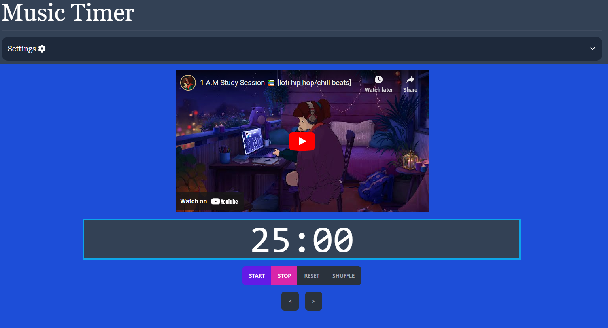

# Music Timer

https://music-timer-7eacc.web.app

An app that lets you sync up a YouTube video and/or playlist to a countdown timer. Originally created to function as a timer for the [Bullet](https://www.level99store.com/products/bullet-star) board games, it has been extended to be usable with other songs and timings. You can set the timer to alert you at various second thresholds with text-to-speech.

This app was written in React and deployed on Firebase. It is a progressive web app and mobile friendly. Tailwind was used for styling.